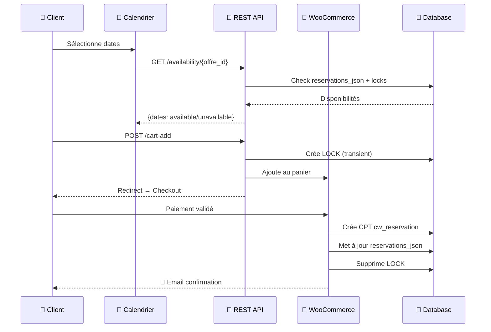

<div align="center">

# 🏢 SkyLounge Coworking

### Système de Réservation Professionnel

[](https://wordpress.org/)
[](https://woocommerce.com/)
[](https://php.net/)
[](LICENSE)

**Solution complète de réservation d'espaces de coworking avec gestion temps réel,<br>paiement intégré et génération automatique de contrats.**

[📖 Documentation](#-architecture) · [🚀 Démarrage](#-démarrage-rapide) · [🔌 API](#-api-rest) · [📊 Tests](#-tests)

---


</div>

---

## ✨ Fonctionnalités

<table>
<tr>
<td width="50%">

### 🎯 Côté Client
- 📅 Calendrier interactif avec disponibilités temps réel
- 💳 Paiement sécurisé via WooCommerce (checkout invité)
- 📧 Confirmation par email automatique (pas de création de compte)
- 📄 Contrat PDF généré et envoyé par email
- 🔒 Système de lock anti-double réservation

</td>
<td width="50%">

### ⚙️ Côté Admin
- 📊 Dashboard premium inspiré Cal.com/Linear
- 🔔 Notifications temps réel (nouvelles réservations)
- 📆 Vue planning hebdomadaire/mensuelle
- 🛠️ Outils de maintenance automatiques
- 📈 Statistiques et KPIs

</td>
</tr>
</table>

---

## 🏗️ Architecture

```
┌─────────────────────────────────────────────────────────────────────────────┐
│                              🖥️  FRONTEND                                   │
│                                                                             │
│    ┌─────────────────┐    ┌─────────────────┐    ┌─────────────────┐       │
│    │   Calendrier    │    │    Checkout     │    │  Confirmation   │       │
│    │   (Vanilla JS)  │    │    (Invité)     │    │   (Email+PDF)   │       │
│    └────────┬────────┘    └────────┬────────┘    └────────┬────────┘       │
│             │                      │                      │                 │
└─────────────┼──────────────────────┼──────────────────────┼─────────────────┘
              │                      │                      │
              ▼                      ▼                      ▼
┌─────────────────────────────────────────────────────────────────────────────┐
│                           🔌  REST API                                      │
│                                                                             │
│    GET  /availability/{id}    POST /cart-add    POST /calculate-price      │
│                                                                             │
└─────────────────────────────────────────────────────────────────────────────┘
              │                      │                      │
              ▼                      ▼                      ▼
┌─────────────────────────────────────────────────────────────────────────────┐
│                           ⚙️  BOOKING ENGINE                                │
│                                                                             │
│  ┌──────────────┐  ┌──────────────┐  ┌──────────────┐  ┌──────────────┐    │
│  │   Locks      │  │ Disponibilité│  │  Validation  │  │   Pricing    │    │
│  │  (Transients)│  │    Check     │  │   & Sécurité │  │   Engine     │    │
│  └──────────────┘  └──────────────┘  └──────────────┘  └──────────────┘    │
│                                                                             │
└─────────────────────────────────────────────────────────────────────────────┘
              │                      │                      │
              ▼                      ▼                      ▼
┌─────────────────────────────────────────────────────────────────────────────┐
│                           💾  DATA LAYER                                    │
│                                                                             │
│    ┌─────────────┐    ┌─────────────┐    ┌─────────────┐                   │
│    │     ACF     │    │ WooCommerce │    │     CPT     │                   │
│    │   (Offres)  │    │  (Orders)   │    │(Réservations)│                  │
│    └─────────────┘    └─────────────┘    └─────────────┘                   │
│                                                                             │
└─────────────────────────────────────────────────────────────────────────────┘
```

---

## 📦 Stack Technique

| Composant | Technologie | Version | Rôle |
|:---------:|:-----------:|:-------:|:-----|
|  | **WordPress** | 6.x | CMS & Framework |
|  | **WooCommerce** | 8.x | E-commerce & Paiements |
|  | **PHP** | 8.x | Backend Logic |
|  | **JavaScript** | ES6+ | Frontend Interactif |
| 🔧 | **ACF Pro** | 6.x | Custom Fields |
| 📝 | **Code Snippets** | 3.x | Modularité du code |

---

## 📁 Structure des Modules

<details>
<summary><b>🔍 Cliquez pour voir tous les modules (14 fichiers)</b></summary>

| # | Module | Description | Priorité |
|:-:|:-------|:------------|:--------:|
| 1 | `coworking-config` | 🔧 Configuration centrale, constantes, helpers globaux | `1` |
| 2 | `coworking-booking-engine-v2` | 🚀 Moteur principal : API REST, locks, panier | `2` |
| 3 | `systeme-disponibilite` | 📅 Calcul des disponibilités par mois | `3` |
| 4 | `calendrier-coworking-v2` | 🎨 Shortcode calendrier interactif | `4` |
| 5 | `coworking-wc-order-complete` | ✅ Hook création réservation après paiement | `5` |
| 6 | `coworking-admin-columns` | 📊 Colonnes personnalisées tableau admin | `6` |
| 7 | `coworking-admin-metabox` | 📝 Métabox détails réservation | `7` |
| 8 | `page-admin-coworking` | 🎯 Dashboard admin premium | `8` |
| 9 | `coworking-cron` | ⏰ Maintenance quotidienne automatique | `9` |
| 10 | `coworking-notification-system` | 🔔 Badges et alertes admin | `10` |
| 11 | `coworking-json-tools` | 🛠️ Utilitaires JSON sécurisés | `11` |
| 12 | `coworking-generation-contrats` | 📄 Génération PDF contrats | `12` |
| 13 | `woocommerce-tunnel-de-vente` | 🛒 Simplification checkout | `13` |
| 14 | `rgpd-consentement-checkout` | 🔒 Conformité RGPD | `14` |

</details>

---

## 🔄 Flux de Réservation



---

## 🔒 Sécurité

<table>
<tr>
<td width="33%">

### 🔐 Anti-Double Réservation
```
┌─────────────────────┐
│   SYSTÈME DE LOCKS  │
├─────────────────────┤
│ Capacité = 1        │
│ → TTL = 20 minutes  │
├─────────────────────┤
│ Capacité > 1        │
│ → TTL = 5 minutes   │
└─────────────────────┘
```

</td>
<td width="33%">

### ✅ Validations
- `sanitize_text_field()` 
- Regex validation dates
- `current_user_can()` 
- Nonces WordPress
- Rate limiting API

</td>
<td width="33%">

### 🇪🇺 Conformité RGPD
- ☑️ Checkbox consentement
- 🔒 IP anonymisée
- ⏰ CRON suppression 3 ans
- 📋 Logs conformes

</td>
</tr>
</table>

---

## 🔌 API REST

### Endpoints disponibles

```http
# Récupérer les disponibilités d'une offre
GET /wp-json/coworking/v1/availability/{offre_id}?month=2025-01

# Ajouter une réservation au panier
POST /wp-json/coworking/v1/cart-add
Content-Type: application/json

{
  "offre_id": 123,
  "formule": "semaine",
  "start": "2025-01-15",
  "quantity": 2
}

# Calculer le prix
POST /wp-json/coworking/v1/calculate-price
Content-Type: application/json

{
  "offre_id": 123,
  "formule": "journee",
  "quantity": 5
}
```

### Codes de réponse

| Code | Constante | Description |
|:----:|:----------|:------------|
| `200` | `SUCCESS` | Opération réussie |
| `400` | `MISSING_PARAMS` | Paramètres manquants |
| `400` | `DATE_TOO_SOON` | Date < J+1 |
| `409` | `DATE_UNAVAILABLE` | Créneau déjà réservé |
| `500` | `PRICE_NOT_CONFIGURED` | Tarif non configuré |
| `500` | `WC_INACTIVE` | WooCommerce inactif |

---

## 🧪 Tests

### Scénarios validés

| # | Scénario | Statut |
|:-:|:---------|:------:|
| T01 | Réservation simple (jour/semaine/mois) | ✅ |
| T02 | Gestion multi-quantité | ✅ |
| T03 | Double réservation bloquée (locks) | ✅ |
| T04 | Expiration automatique des locks | ✅ |
| T05 | Annulation et libération créneaux | ✅ |
| T06 | Consentement RGPD obligatoire | ✅ |
| T07 | Génération contrat automatique | ✅ |
| T08 | Anonymisation IP checkout | ✅ |
| T09 | CRON maintenance quotidienne | ✅ |
| T10 | Dashboard admin responsive | ✅ |

---

## ⏰ Maintenance Automatique

Le CRON s'exécute quotidiennement à **03h00** :

```php
function coworking_run_daily_maintenance() {
    coworking_clean_expired_locks();      // 🧹 Nettoie locks expirés
    coworking_clean_orphaned_locks();     // 🔗 Locks sans commande
    coworking_clean_old_drafts();         // 📝 Brouillons > 24h
    coworking_repair_reservations_json(); // 🔧 Cohérence JSON
    coworking_anonymize_old_reservations(); // 🔒 RGPD 3 ans
}
```

---

## 📋 Roadmap

- [x] ~~Système de réservation complet~~
- [x] ~~Dashboard admin premium~~
- [x] ~~Intégration WooCommerce~~
- [x] ~~Conformité RGPD~~
- [ ] 📄 Génération contrats PDF (en cours)
- [ ] 🧪 Tests unitaires PHPUnit
- [ ] 📚 Documentation Swagger/OpenAPI
- [ ] 📱 Application mobile (phase 2)

---

## 🚀 Démarrage Rapide

### Prérequis

```bash
WordPress >= 6.0
WooCommerce >= 8.0
PHP >= 8.0
ACF Pro >= 6.0
Plugin Code Snippets >= 3.0
```

### Installation

1. **Importer les champs ACF**
   ```
   ACF → Outils → Importer → acf-export-2025-12-19.json
   ```

2. **Activer les modules Code Snippets**
   ```
   Suivre l'ordre de priorité (1 → 14)
   ```

3. **Configurer WooCommerce**
   ```
   Créer les produits "Bureau privé" et "Salle de réunion"
   Mettre à jour les IDs dans coworking-config.php
   ```

4. **Ajouter le shortcode**
   ```php
   [coworking_calendar]
   ```

---

## 👤 Auteur

<div align="center">

**Jérémy VIDOCIN**

[](https://github.com/)
[](https://linkedin.com/)

*Projet réalisé en Décembre 2025*

</div>

---

<div align="center">

**[⬆ Retour en haut](#-skylounge-coworking)**

</div>
